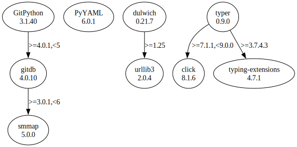

# Third Party Dependencies

<!--[[[fill sbom_sha256()]]]-->
The [SBOM in CycloneDX v1.4 JSON format](https://git.sr.ht/~sthagen/putki/blob/default/sbom/cdx.json) with SHA256 checksum ([ea59ff26 ...](https://git.sr.ht/~sthagen/putki/blob/default/sbom/cdx.json.sha256 "sha256:ea59ff26443d344adeae9d4725e454ddfe029f5ca578fa8c1921158dddfee25a")).
<!--[[[end]]] (checksum: 19d1319e028c1113e5c9c37854d6cf54)-->
## Licenses 

JSON files with complete license info of: [direct dependencies](direct-dependency-licenses.json) | [all dependencies](all-dependency-licenses.json)

### Direct Dependencies

<!--[[[fill direct_dependencies_table()]]]-->
| Name                                                           | Version                                              | License                 | Author                             | Description (from packaging data)                                    |
|:---------------------------------------------------------------|:-----------------------------------------------------|:------------------------|:-----------------------------------|:---------------------------------------------------------------------|
| [GitPython](https://github.com/gitpython-developers/GitPython) | [3.1.31](https://pypi.org/project/GitPython/3.1.31/) | BSD License             | Sebastian Thiel, Michael Trier     | GitPython is a Python library used to interact with Git repositories |
| [PyYAML](https://pyyaml.org/)                                  | [6.0](https://pypi.org/project/PyYAML/6.0/)          | MIT License             | Kirill Simonov                     | YAML parser and emitter for Python                                   |
| [dulwich](https://www.dulwich.io/)                             | [0.21.5](https://pypi.org/project/dulwich/0.21.5/)   | Apache Software License | Jelmer Vernooij <jelmer@jelmer.uk> | Python Git Library                                                   |
| [typer](https://github.com/tiangolo/typer)                     | [0.9.0](https://pypi.org/project/typer/0.9.0/)       | MIT License             | Sebastián Ramírez                  | Typer, build great CLIs. Easy to code. Based on Python type hints.   |
<!--[[[end]]] (checksum: 98cc0324b9beddb5a32e5468f8368e2c)-->

### Indirect Dependencies

<!--[[[fill indirect_dependencies_table()]]]-->
| Name | Version | License | Author | Description (from packaging data) |
|:-----|:--------|:--------|:-------|:----------------------------------|
<!--[[[end]]] (checksum: 8a87b89207db0be2864af66f9266660c)-->

## Dependency Tree(s)

JSON file with the complete package dependency tree info of: [the full dependency tree](package-dependency-tree.json)

### Rendered SVG

Base graphviz file in dot format: [Trees of the direct dependencies](package-dependency-tree.dot.txt)



### Console Representation

<!--[[[fill dependency_tree_console_text()]]]-->
````console
dulwich==0.21.5
└── urllib3 [required: >=1.25, installed: 1.26.13]
GitPython==3.1.31
└── gitdb [required: >=4.0.1,<5, installed: 4.0.10]
    └── smmap [required: >=3.0.1,<6, installed: 5.0.0]
PyYAML==6.0
typer==0.9.0
├── click [required: >=7.1.1,<9.0.0, installed: 8.1.3]
└── typing-extensions [required: >=3.7.4.3, installed: 4.4.0]
````
<!--[[[end]]] (checksum: 0c08dbdf895cf583301d3ee3e7cff3b8)-->
